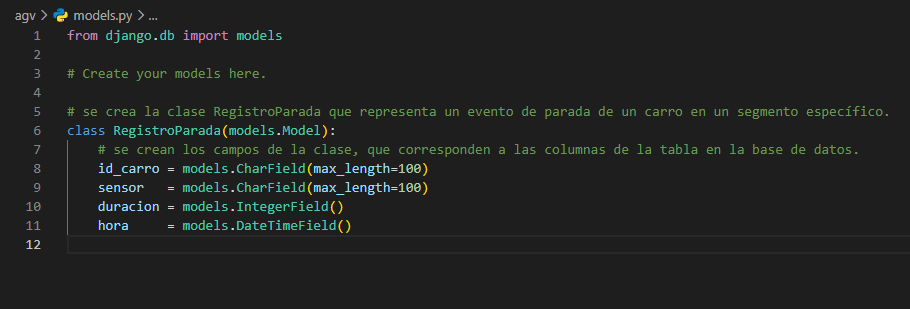
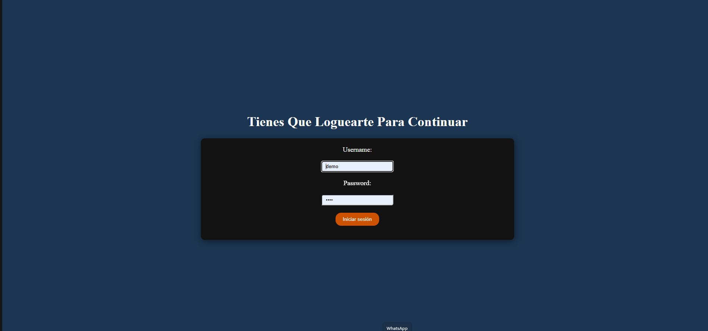
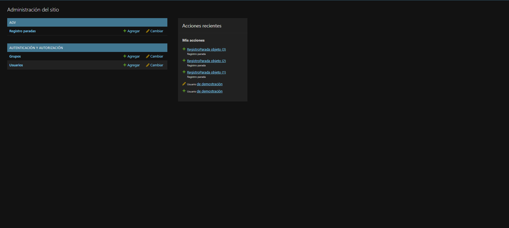
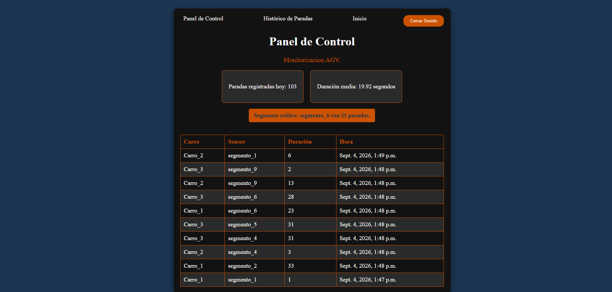
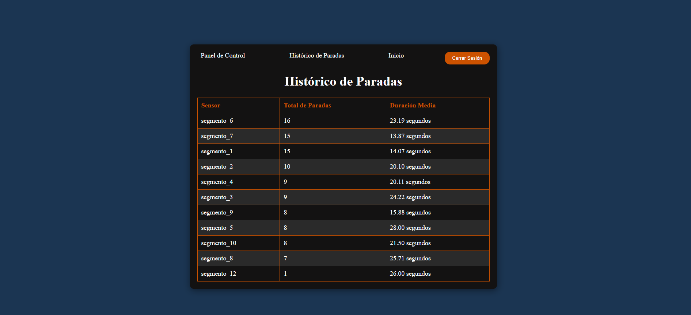
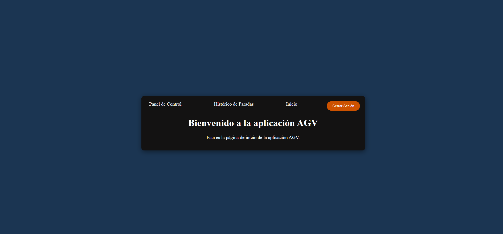
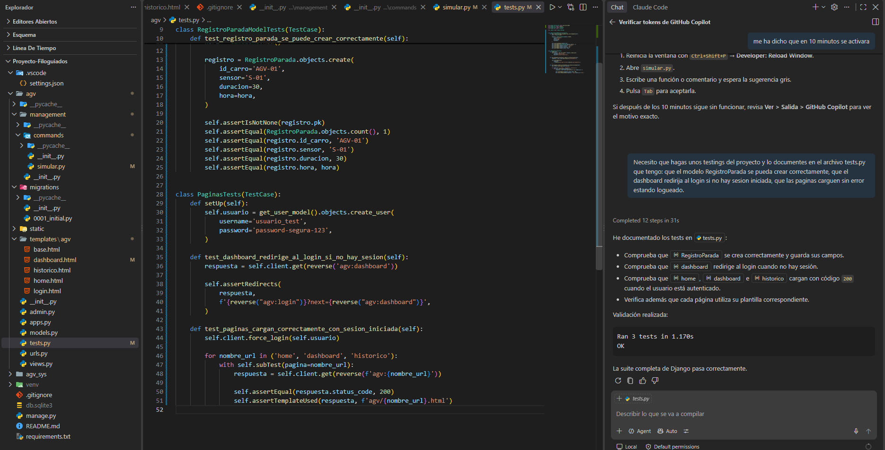
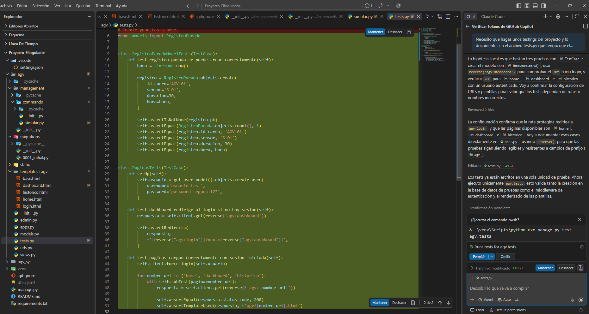

# Sistema de Monitorización AGV — Documento de Entrega

---

## 1. Objetivos del proyecto

El proyecto nace de una necesidad detectada en el entorno real de producción: actualmente, la detección de paradas de los AGVs en su recorrido depende en gran medida de la comunicación manual entre los operarios de planta y la oficina de monitorización — son los propios operarios quienes, al no ver llegar un carro, avisan para que se compruebe su ubicación. Este proceso reactivo introduce un tiempo de respuesta variable y depende del factor humano, retrasando la detección de incidencias.

Esta demora tiene un impacto directo en la producción: si un AGV se detiene y la incidencia no se detecta a tiempo, el material que transporta no llega a la línea correspondiente, pudiendo derivar en paradas de la propia línea de producción por falta de material — un problema con un coste mucho mayor que la simple parada del carro en sí.

El objetivo principal del Sistema de Monitorización AGV es automatizar esta detección: registrar cada parada del recorrido con su ubicación (sensor/segmento), duración y momento exacto, y ofrecer una visualización clara y centralizada (a través de un panel de control accesible mediante login) que permita detectar de un vistazo qué segmentos superan un umbral de tiempo considerado anómalo, sin depender de que alguien note la incidencia manualmente.

Con ello se busca reducir el tiempo de reacción ante paradas, minimizar el riesgo de paradas de producción por falta de material, facilitar el análisis histórico de qué tramos del recorrido son más problemáticos, y sentar una base software que en el futuro podría ampliarse con avisos físicos (sonoros o luminosos) en la propia planta.

---

## 2. Stack tecnológico y alternativas evaluadas

El framework elegido para el desarrollo del proyecto es Django. La decisión responde a dos razones principales:

En primer lugar, una razón práctica: de las opciones vistas durante la formación (Django, Flask, Tkinter), Django es el framework en el que se ha adquirido un dominio real y suficiente para desarrollar un proyecto completo con garantías, frente a un conocimiento más superficial de las otras alternativas. Se ha priorizado construir algo sólido y bien entendido de principio a fin, antes que arriesgar la viabilidad del proyecto explorando una tecnología nueva bajo la presión de un plazo de entrega.

En segundo lugar, una razón técnica: Django resuelve de un solo golpe tres de los cuatro requisitos mínimos exigidos por el curso — framework web, programación orientada a objetos (los modelos de datos son clases que heredan de `models.Model`) y sistema de login/control de accesos (incluido de fábrica, sin necesidad de programarlo desde cero). Tkinter, al ser una librería de interfaces de escritorio y no un framework web, quedó descartada al no encajar con el enfoque de aplicación accesible desde navegador. Flask, aunque también viable, se descartó por ser un framework más minimalista que habría requerido construir a mano funcionalidades (como el sistema de autenticación) que Django ya trae integradas.

Evidencia de la programación orientada a objetos: el modelo `RegistroParada`, definido como una clase que hereda de `models.Model`.

Evidencia del sistema de login incluido en Django:

---

## 3. Explicación y esquema de la base de datos

El sistema utiliza una única tabla, `RegistroParada`, que almacena cada parada detectada durante el recorrido de los AGVs:

| Campo | Tipo | Descripción |
|---|---|---|
| `id` | INTEGER (autoincremental) | Clave primaria, generada automáticamente por Django. |
| `id_carro` | CharField | Identificador del AGV que ha sufrido la parada (ej. "Carro_1"). |
| `sensor` | CharField | Segmento/tramo del recorrido donde se ha detectado la parada (ej. "Segmento_3"). |
| `duracion` | IntegerField | Duración de la parada, en segundos. |
| `hora` | DateTimeField | Fecha y hora exactas en que se registró la parada. |

El campo `id` es autoincremental y actúa como clave primaria en lugar de cualquier otro campo del modelo. La razón es que, al circular varios AGVs simultáneamente, dos paradas de carros distintos podrían coincidir exactamente en fecha y hora — por lo que ningún campo por sí solo garantiza unicidad. El `id` autoincremental, generado automáticamente por Django, resuelve esto sin necesidad de gestión manual: cada parada queda identificada de forma única independientemente de que coincida con otra en cualquier otro dato.

Por otro lado, el archivo `db.sqlite3` (donde Django almacena físicamente los datos) se ha excluido del control de versiones mediante `.gitignore`. El motivo principal no es que los datos sean sensibles (son datos simulados de prueba), sino que es un archivo binario: Git no puede mostrar qué ha cambiado línea a línea entre versiones, por lo que cada modificación de datos "ensuciaría" el historial de commits repitiendo el archivo entero. Si en algún momento fuera necesario mostrar datos de ejemplo sin subir el binario, la alternativa contemplada es exportar datos concretos a un archivo de *fixtures* (formato JSON que Django puede cargar).

Evidencia de la tabla `RegistroParada` con registros reales, vista desde el panel de administración de Django:

---

## 4. Explicación de los requisitos de la aplicación

El sistema simula el funcionamiento de una flota de 3 AGVs (vehículos de guiado automático) circulando simultáneamente, cada uno identificado de forma única. Cada AGV recorre un trayecto de ida y vuelta de aproximadamente 100 metros cada tramo, dividido en 10 sensores/tramos de control en total (5 en el camino de ida, 5 en el de vuelta), que detectan el paso del carro por cada punto del recorrido.

Cuando un AGV permanece detenido en un tramo durante más de un umbral de tiempo establecido (~20 segundos), el sistema registra la parada (vehículo, sensor/tramo, duración y momento exacto) y la muestra como aviso visual destacado en el panel de control, permitiendo identificar de un vistazo qué segmento está dando problemas en ese momento.

Es importante señalar el alcance deliberado del sistema: se trata de una simulación 100% software, sin integración con hardware real (sensores físicos, luces o sonidos en planta). El sistema se limita a DETECTAR y AVISAR de la incidencia — no diagnostica ni explica la causa de la parada (una avería mecánica, un obstáculo, una incidencia del operario, etc.), esa interpretación queda en manos del equipo humano que recibe el aviso.

Evidencia del panel de control (dashboard), con los datos generados en tiempo real por la simulación:

Evidencia de la página de histórico, con el agregado de paradas por sensor:

---

## 5. Manual de instalación

A continuación se detallan los pasos necesarios para poner en marcha el proyecto desde cero en un equipo nuevo, en el orden en que deben ejecutarse.

**Requisito previo:** tener Python instalado en el sistema. El entorno virtual que se crea en el paso siguiente se genera a partir de esa instalación de Python ya existente en el equipo.

1. Crear la carpeta del proyecto y abrirla en el editor de código (en este caso, Visual Studio Code).
2. Crear un entorno virtual, para aislar las dependencias del proyecto del resto del sistema:
   `python -m venv venv`
3. Activar el entorno virtual (en PowerShell):
   `.\venv\Scripts\Activate.ps1`
4. Instalar las dependencias del proyecto dentro del entorno virtual ya activado. El proyecto incluye un archivo `requirements.txt` con las librerías necesarias y sus versiones exactas (generado con `pip freeze > requirements.txt`), por lo que basta con:
   `pip install -r requirements.txt`
5. Crear el proyecto Django, que genera la estructura de archivos y directorios base:
   `django-admin startproject agv_sys .`
6. Crear la app `agv` dentro del proyecto:
   `python manage.py startapp agv`
7. Registrar la app en el archivo de configuración `settings.py`, añadiendo `'agv'` a la lista `INSTALLED_APPS`, para que Django la reconozca como parte del proyecto.
8. Generar las migraciones a partir de los modelos definidos en `models.py`:
   `python manage.py makemigrations`
9. Aplicar esas migraciones para crear realmente las tablas en la base de datos (`db.sqlite3`):
   `python manage.py migrate`
10. Crear un superusuario, necesario para poder iniciar sesión y acceder a las páginas protegidas del sistema:
    `python manage.py createsuperuser`
11. Arrancar el servidor de desarrollo:
    `python manage.py runserver`

Con estos pasos, la aplicación queda accesible desde el navegador (por defecto en `http://127.0.0.1:8000/`), con el login funcionando y la base de datos lista para recibir registros.

Adicionalmente, el proyecto incluye dos comandos propios, no estándar de Django, pensados para la demostración y verificación del sistema:

- `python manage.py simular` — lanza la simulación de los 3 AGVs, que genera paradas de forma continua y las guarda en tiempo real en la base de datos, permitiendo ver el panel de control y el histórico poblarse con datos sin necesidad de introducirlos a mano.
- `python manage.py test agv` — ejecuta las pruebas mínimas del proyecto (verificación del modelo `RegistroParada` y de la protección/carga correcta de las páginas principales).

Tras completar estos pasos, la página de inicio de la aplicación queda accesible y navegable:

---

## 6. Conclusiones y evolutivos del proyecto

La valoración general del proyecto es muy positiva. Ha permitido comprobar de forma práctica cómo piezas que a lo largo del curso se trabajaron por separado (modelos y base de datos, plantillas, autenticación, panel de administración) terminan encajando entre sí para formar una aplicación completa y coherente. El resultado final, con un panel de control donde se puede ver de un vistazo el estado del sistema y una base de datos que registra todo lo que ocurre por debajo, cumple con lo que se buscaba desde el planteamiento inicial del proyecto.

La parte que más ha costado ha sido interiorizar la lógica de programación en sí: entender que cada decisión de diseño arrastra consecuencias en otras partes del código (por ejemplo, cómo una estructura de datos elegida en la simulación condiciona después cómo se puede consultar esa información en el histórico). A esto se suma la propia complejidad de Django: es un framework que genera muchos archivos y sigue convenciones estrictas, lo que al principio resulta confuso, pero que a la vez ofrece herramientas muy completas (como el sistema de formularios o el login) que evitan tener que programar desde cero funcionalidades complejas. El login, en concreto, fue una de las partes más tediosas de resolver, aunque también una de las que más aprendizaje ha dejado — combinando apuntes del curso, documentación oficial y apoyo puntual de IA, pero entendiendo y asimilando cada paso antes de darlo por bueno, no solo copiando una solución.

En conjunto, se considera que el proyecto cumple con todos los puntos exigidos por el curso (framework web, programación orientada a objetos, sistema de login y control de accesos, base de datos), y el resultado final es motivo de satisfacción personal.

Como nota adicional, cabe destacar que la parte de la simulación (implementada mediante un management command de Django) exigió consultar directamente la documentación oficial de Django, al no formar parte explícita del temario del curso — un ejercicio de investigación autónoma que se considera parte importante del aprendizaje obtenido con este proyecto.

Respecto a las pruebas mínimas del proyecto (`tests.py`), su desarrollo se apoyó en GitHub Copilot. El proceso se revisó y se entendió cada prueba generada antes de aceptarla, garantizando que no se trata de código incorporado sin comprender su funcionamiento:

### Evolutivos futuros

De cara a una posible evolución del sistema más allá del alcance de este proyecto, se identifican varias líneas de mejora:

- **Integración con hardware real**: el sistema actual es una simulación 100% software. Un siguiente paso natural sería sustituir la simulación por sensores físicos reales en la planta, y añadir un aviso físico (sonoro y/o luminoso) en el propio punto donde se detecta la parada, para que el personal de planta localice el incidente sin depender únicamente del panel de control.
- **Distancia real entre sensores**: actualmente el sistema conoce la secuencia de sensores por los que pasa cada AGV y el tiempo que permanece detenido en cada uno, pero no la distancia física real entre ellos — dato que en este proyecto es puramente descriptivo y no forma parte de ningún cálculo del sistema. Incorporar esa distancia permitiría, además de detectar paradas, estimar la velocidad real de cada AGV en movimiento.
- **Filtros y búsqueda avanzada** en el histórico de paradas (por rango de fechas, por AGV concreto, por segmento), para facilitar el análisis cuando el volumen de datos histórico crezca.
